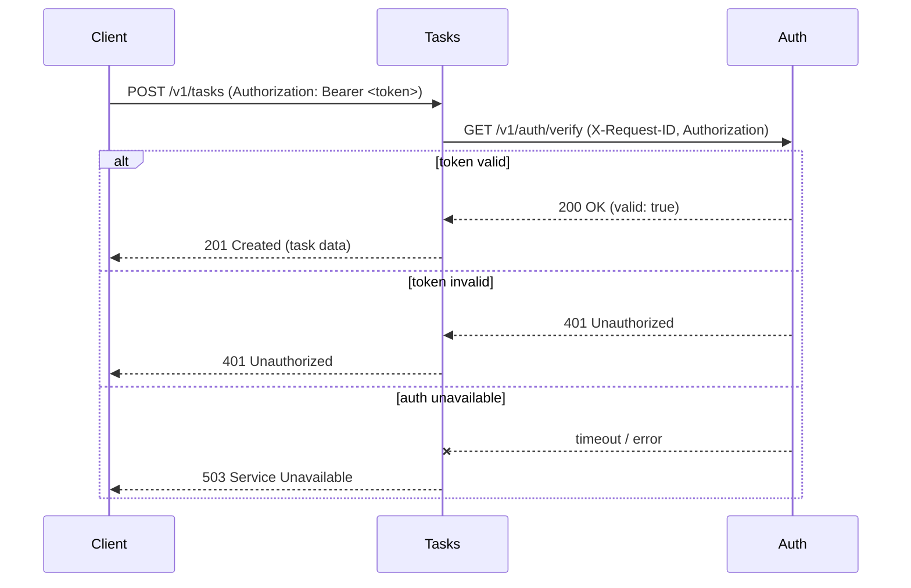
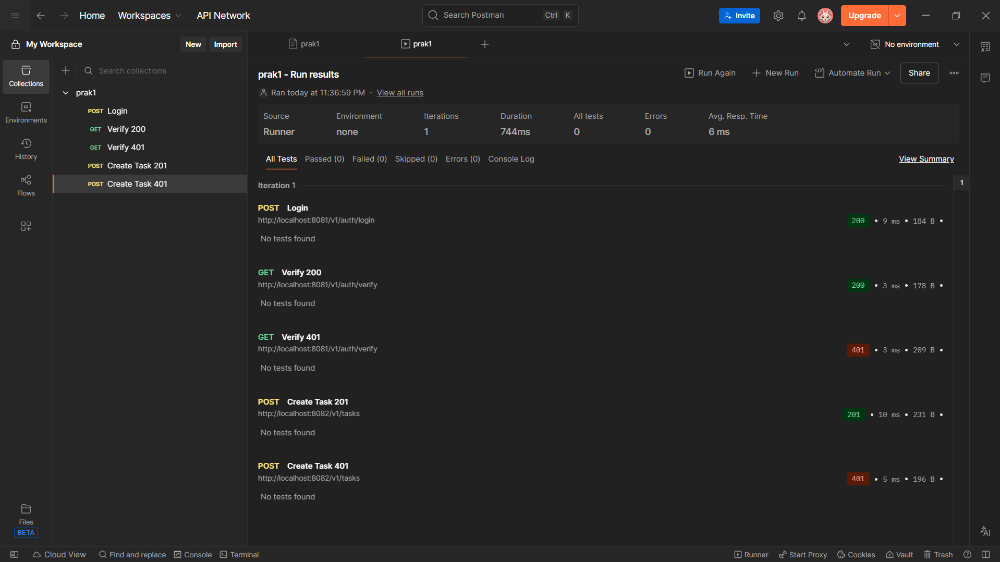
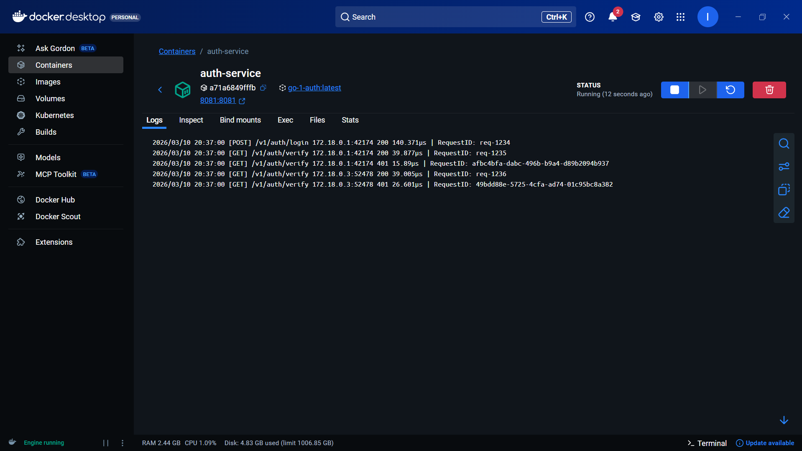
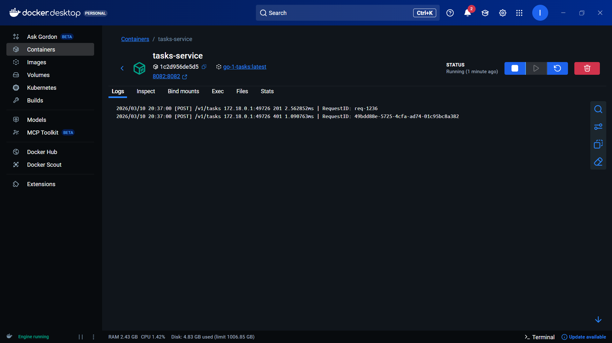

# Практическое задание 1. Разделение монолита на 2 микросервиса. Взаимодействие через HTTP

**Студент:** Ильин Владислав Викторович
**Группа:** ЭФМО-02-25

---

## Цель работы
Научиться декомпозировать монолитное приложение на два микросервиса (Auth и Tasks), организовать их синхронное взаимодействие по HTTP с использованием таймаутов, проброса request-id и базового логирования.

---

## Границы ответственности сервисов

- **Auth service** – отвечает за выдачу и проверку доступа. В учебной реализации используется фиксированный токен `demo-token`. Сервис предоставляет два эндпоинта: логин (получение токена) и верификацию (проверка токена).
- **Tasks service** – управляет задачами (CRUD). Все эндпоитнты требуют наличия валидного токена. Проверка токена выполняется синхронным вызовом к Auth service с пробросом request-id и соблюдением таймаута.

---

## Схема взаимодействия (Mermaid)



---

## Список эндпоинтов

### Auth service (порт 8081)

| Метод | Путь              | Описание                          | Заголовки               |
|-------|-------------------|-----------------------------------|-------------------------|
| POST  | `v1/auth/login`   | Получение токена                  | –                       |
| GET   | `v1/auth/verify`  | Проверка токена                   | `Authorization: Bearer` |

### Tasks service (порт 8082)

| Метод  | Путь               | Описание                | Заголовки               |
|--------|--------------------|-------------------------|-------------------------|
| POST   | `v1/tasks`        | Создать задачу           | `Authorization: Bearer` |
| GET    | `v1/tasks`        | Список задач             | `Authorization: Bearer` |
| GET    | `v1/tasks/{id}`   | Получить задачу по ID    | `Authorization: Bearer` |
| PATCH  | `v1/tasks/{id}`   | Обновить задачу          | `Authorization: Bearer` |
| DELETE | `v1/tasks/{id}`   | Удалить задачу           | `Authorization: Bearer` |

---

## Подтверждение проброса request-id (логи)

При выполнении запросов через curl с заголовком `X-Request-ID` в логах обоих сервисов отображается соответствующий идентификатор, что позволяет отследить цепочку вызовов.

### Запросы cURL

**Запрос на получение токена с request-id:**
```bash
curl --location 'http://localhost:8081/v1/auth/login' \
--header 'X-Request-ID: req-1234' \
--header 'Content-Type: application/json' \
--data '{
    "username": "student",
    "password": "student"
}'
```

**Запрос на верификацию с request-id:**
```bash
curl --location 'http://localhost:8081/v1/auth/verify' \
--header 'X-Request-ID: req-1235' \
--header 'Authorization: Bearer demo-token'
```

**Запрос на верификацию с request-id:**
```bash
curl --location 'http://localhost:8081/v1/auth/verify' \
--header 'X-Request-ID: req-1235' \
--header 'Authorization: Bearer demo-token'
```

**Запрос на верификацию без токена и request-id:**
```bash
curl --location 'http://localhost:8081/v1/auth/verify' \
--header 'Authorization: Bearer 1234'
```

**Запрос на верификацию без токена и request-id:**
```bash
curl --location 'http://localhost:8081/v1/auth/verify' \
--header 'Authorization: Bearer 1234'
```

**Запрос на создание задачи с токеном и request-id:**
```bash
curl --location 'http://localhost:8082/v1/tasks' \
--header 'X-Request-ID: req-1236' \
--header 'Content-Type: application/json' \
--header 'Authorization: Bearer demo-token' \
--data '{
    "title": "Do PZ1",
    "description": "split services",
    "due_date": "2026-01-10"
}'
```

**Запрос на создание задачи без токена и request-id:**
```bash
curl --location 'http://localhost:8082/v1/tasks' \
--header 'Content-Type: application/json' \
--header 'Authorization: Bearer 1234' \
--data '{
    "title": "Do PZ1",
    "description": "split services",
    "due_date": "2026-01-10"
}'
```

### Результаты выполнения







Из логов видно, что request-id пробрасывается из Tasks в Auth и фиксируется в обоих сервисах, что упрощает диагностику.

---

## Инструкция по запуску

```bash
docker-compose up --build
```

Сервисы будут доступны на `localhost:8081` (auth) и `localhost:8082` (tasks).
