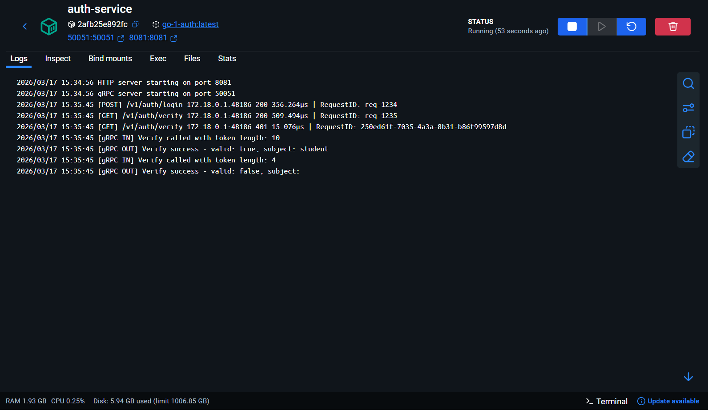

# Практическое задание 2. gRPC: создание простого микросервиса, вызовы методов

**Студент:** Ильин Владислав Викторович
**Группа:** ЭФМО-02-25

---

## Цель работы
Научиться работать с gRPC: описывать контракт в .proto, поднимать gRPC-сервер и вызывать его из другого сервиса (клиента) с дедлайном.

---

## Proto файл

```mermaid
syntax = "proto3";

package auth;

option go_package = "tech-ip-sem2/services/auth/pkg/authpb";

message VerifyRequest {
  string token = 1;
}

message VerifyResponse {
  bool valid = 1;
  string subject = 2;
  string error = 3;
}

service AuthenticationService {
  rpc Verify(VerifyRequest) returns (VerifyResponse);
}
```

## Команда генерации
```
D:\Tools\protoc\bin\protoc.exe      --go_out=paths=source_relative:./services/auth/pkg/authpb --go-grpc_out=paths=source_relative:./services/auth/pkg/authpb ./proto/auth.proto
```

---

## Логирование grpc сервиса



Из логов видно, что grpc сервис работает.

### Запросы cURL

**Запрос на получение токена с request-id:**
```bash
curl --location 'http://localhost:8081/v1/auth/login' \
--header 'X-Request-ID: req-1234' \
--header 'Content-Type: application/json' \
--data '{
    "username": "student",
    "password": "student"
}'
```

**Запрос на создание задачи с токеном и request-id:**
```bash
curl --location 'http://localhost:8082/v1/tasks' \
--header 'X-Request-ID: req-1236' \
--header 'Content-Type: application/json' \
--header 'Authorization: Bearer demo-token' \
--data '{
    "title": "Do PZ1",
    "description": "split services",
    "due_date": "2026-01-10"
}'
```

**Запрос на создание задачи без токена и request-id:**
```bash
curl --location 'http://localhost:8082/v1/tasks' \
--header 'Content-Type: application/json' \
--header 'Authorization: Bearer 1234' \
--data '{
    "title": "Do PZ1",
    "description": "split services",
    "due_date": "2026-01-10"
}'
```

## Инструкция по запуску

```bash
docker-compose up --build
```

Сервисы будут доступны на `localhost:8081` и `localhost:50051` (auth) и `localhost:8082` (tasks).
