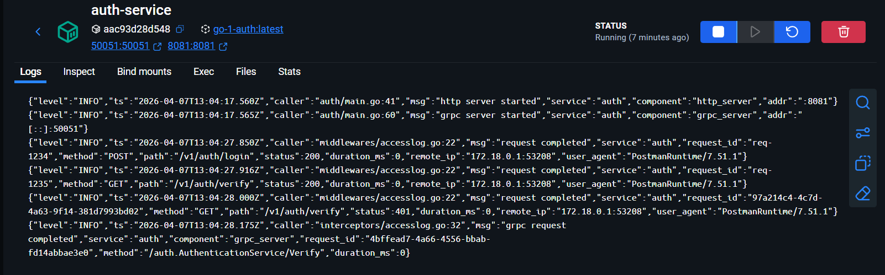
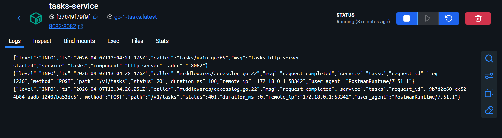

# Практическое задание 3. Логирование с помощью logrus или zap. Ведение структурированных логов

**Студент:** Ильин Владислав Викторович
**Группа:** ЭФМО-02-25

---

## Выбор логгера
В качестве логгера для сервисов auth и tasks выбран пакет zap от Uber. Основная причина: логгеры очень похожи, но zap по умолчанию пишет логи в структурированном JSON-формате, что соответствует требованиям задания и упрощает фильтрацию/поиск в будущем.

---

## Логирование сервисов

### Сервис auth


### Сервис tasks


## Запросы cURL

**Запрос на получение токена с request-id:**
```bash
curl --location 'http://localhost:8081/v1/auth/login' \
--header 'X-Request-ID: req-1234' \
--header 'Content-Type: application/json' \
--data '{
    "username": "student",
    "password": "student"
}'
```

**Запрос на создание задачи с токеном и request-id:**
```bash
curl --location 'http://localhost:8082/v1/tasks' \
--header 'X-Request-ID: req-1236' \
--header 'Content-Type: application/json' \
--header 'Authorization: Bearer demo-token' \
--data '{
    "title": "Do PZ1",
    "description": "split services",
    "due_date": "2026-01-10"
}'
```

**Запрос на создание задачи без токена и request-id:**
```bash
curl --location 'http://localhost:8082/v1/tasks' \
--header 'Content-Type: application/json' \
--header 'Authorization: Bearer 1234' \
--data '{
    "title": "Do PZ1",
    "description": "split services",
    "due_date": "2026-01-10"
}'
```

## Инструкция по запуску

```bash
docker-compose up --build
```

Сервисы будут доступны на `localhost:8081` и `localhost:50051` (auth) и `localhost:8082` (tasks).
