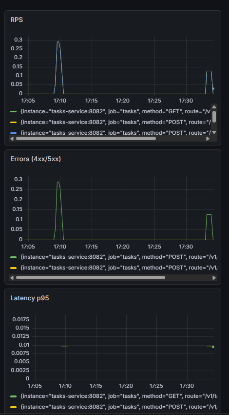

# Практическое задание 4. Настройка Prometheus + Grafana для метрик. Интеграция с приложением

**Студент:** Ильин Владислав Викторович
**Группа:** ЭФМО-02-25

---

## Метрики

| Метрика | Тип | Описание |
|---|---|---|
| `http_requests_total` | Counter | Общее число запросов (labels: method, route, status) |
| `http_request_duration_seconds` | Histogram | Время обработки запросов |
| `http_in_flight_requests` | Gauge | Текущее число активных запросов |

---

## Пример вывода /metrics

```bash
process_cpu_seconds_total 2.41
# HELP process_max_fds Maximum number of open file descriptors.
# TYPE process_max_fds gauge
process_max_fds 1.048576e+06
# HELP process_network_receive_bytes_total Number of bytes received by the process over the network.
# TYPE process_network_receive_bytes_total counter
process_network_receive_bytes_total 337259
# HELP process_network_transmit_bytes_total Number of bytes sent by the process over the network.
# TYPE process_network_transmit_bytes_total counter
process_network_transmit_bytes_total 1.493145e+06
# HELP process_open_fds Number of open file descriptors.
# TYPE process_open_fds gauge
process_open_fds 10
# HELP process_resident_memory_bytes Resident memory size in bytes.
# TYPE process_resident_memory_bytes gauge
process_resident_memory_bytes 2.5739264e+07
# HELP process_start_time_seconds Start time of the process since unix epoch in seconds.
# TYPE process_start_time_seconds gauge
process_start_time_seconds 1.77557006059e+09
# HELP process_virtual_memory_bytes Virtual memory size in bytes.
# TYPE process_virtual_memory_bytes gauge
process_virtual_memory_bytes 1.270669312e+09
# HELP process_virtual_memory_max_bytes Maximum amount of virtual memory available in bytes.
# TYPE process_virtual_memory_max_bytes gauge
process_virtual_memory_max_bytes 1.8446744073709552e+19
# HELP promhttp_metric_handler_requests_in_flight Current number of scrapes being served.
# TYPE promhttp_metric_handler_requests_in_flight gauge
promhttp_metric_handler_requests_in_flight 1
# HELP promhttp_metric_handler_requests_total Total number of scrapes by HTTP status code.
# TYPE promhttp_metric_handler_requests_total counter
promhttp_metric_handler_requests_total{code="200"} 565
promhttp_metric_handler_requests_total{code="500"} 0
promhttp_metric_handler_requests_total{code="503"} 0
```
## Docker compose для Prometheus и Grafana

docker-compose.yml
```bash
version: "3.8"

services:
  prometheus:
    image: prom/prometheus:latest
    container_name: prometheus
    volumes:
      - ./prometheus.yml:/etc/prometheus/prometheus.yml:ro
    command:
      - "--config.file=/etc/prometheus/prometheus.yml"
      - "--storage.tsdb.path=/prometheus"
      - "--storage.tsdb.retention.time=24h"
    ports:
      - "9090:9090"
    networks:
      - app-network

  grafana:
    image: grafana/grafana:latest
    container_name: grafana
    environment:
      - GF_SECURITY_ADMIN_USER=admin
      - GF_SECURITY_ADMIN_PASSWORD=admin
    ports:
      - "3000:3000"
    depends_on:
      - prometheus
    networks:
      - app-network

networks:
  app-network:
    external: true

```

prometheus.yml
```bash
global:
  scrape_interval: 5s

scrape_configs:
  - job_name: "tasks"
    metrics_path: "/metrics"
    static_configs:
      - targets: ["tasks-service:8082"]


```

## Графики Grafana



## Инструкция по запуску

```bash
docker network create app-network
docker-compose up --build -d
cd deploy/monitoring
docker-compose up --build -d
```
